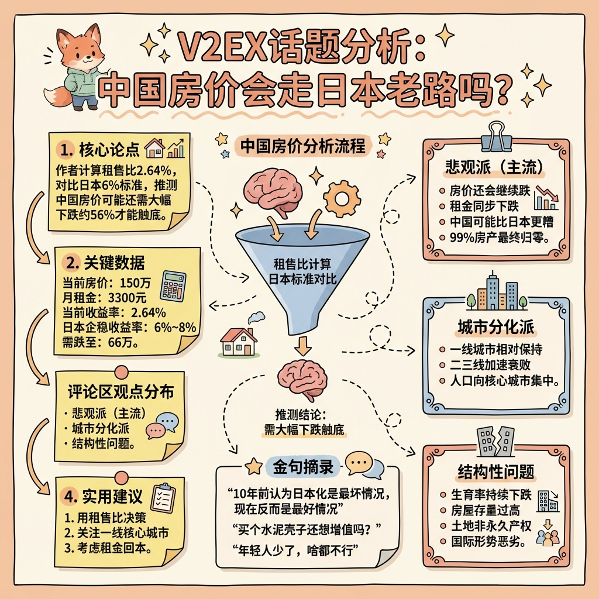

# V2EX Analysis 1185620

---

## 一、核心内容（搞清楚"是什么"）

### 1. 核心论点
作者通过计算自己房产的租售比（毛收益率2.64%），对比日本房价企稳时的6%收益率标准，推测中国房价可能还需大幅下跌才能触底。

### 2. 关键概念
- **住宅毛收益率**：年租金收入/房价，衡量房产投资回报的核心指标
- **日本式"合理区间"**：毛收益率6%~8%，被视为房价止跌、长期资金入场的信号
- **无风险利率溢价**：房租收益率应高于银行存款/国债收益率4~5个百分点

### 3. 论证结构
作者采用简单的数学推算：当前房价150万，月租3300元（年租约4万），收益率2.64%。若要达到6%收益率，房价需跌至66万——即还需下跌约56%。

### 4. 支撑证据
- 个人房产数据（150万房价，3300元月租）
- GPT提供的日本历史数据（企稳时收益率6%~8%，当时日本国债利率1%~1.5%）

---

## 二、背景语境（理解"为什么"）

### 1. 作者背景
用户名hwenzhuo000，V2EX普通用户，从其发言看是一位持有房产、正在考虑是否置换的普通业主，非专业投资者或经济学者。

### 2. 写作背景
- 中国房地产市场持续下行，多地房价已从高点腰斩
- 日本"失去的三十年"成为中国经济讨论的热门参照物
- 社会对房价走势存在普遍焦虑，尤其是持房群体

### 3. 想解决的问题
试图寻找房价的"底"在哪里，为自己的资产决策（是否卖房/换房）提供参考依据。

### 4. 底层假设
- 日本经验对中国有参考价值
- 租售比是判断房价合理性的有效指标
- 租金水平相对稳定（这一假设后被评论区质疑）

---

## 三、批判性审视

### 1. 主要反对意见
评论区提出了多个有力反驳：
- **租金会同步下跌**（@pordria, @dna1982, @frankies）：房价跌的同时租金也在跌，6%收益率可能永远达不到
- **中日房产性质不同**（@liu731）：日本土地永久产权，中国只是70年使用权的"水泥壳子"
- **中国可能比日本更糟**（@argentea, @DOOMS）：中国尚未经历日本的辉煌期就已进入下行通道

### 2. 论证漏洞
- 假设租金不变是重大缺陷
- GPT数据未经验证，可靠性存疑
- 单一房产样本无法代表整体市场
- 未考虑中国特殊的土地制度、政策干预等因素

### 3. 观点边界
- **成立条件**：纯市场化运作、租金稳定、中日可比
- **不成立条件**：政策强力托市、租金同步下跌、中国特殊国情

### 4. 回避的问题
- 政府救市政策的影响
- 城市分化（一线vs其他城市）
- 人口流动趋势的具体影响

---

## 四、价值提取

### 1. 可复用的思考框架
**租售比分析法**：用收益率衡量房产价值，而非单纯看价格涨跌。这是一种将房产"证券化"思考的方法，适用于任何投资品估值。

### 2. 对普通购房者的启示
- 不要只看房价，更要看租金收益率
- 需要考虑"如果卖不掉，靠租金能回本吗"
- 一线城市相对抗跌，但并非绝对安全

### 3. 对投资者的启示
- 当前收益率仍偏低，可能尚未到抄底时机
- 需关注租金走势而非仅盯房价
- 城市选择比时机选择更重要（长三角、珠三角核心城市）

### 4. 认知改变
打破"房价只涨不跌"的惯性思维，引入国际比较视角，用数据而非情绪判断市场。

---

## 五、讨论亮点摘录

| 观点 | 用户 | 核心洞见 |
|------|------|----------|
| 最好情况是日本老路 | @argentea | 10年前认为日本化是最坏情况，现在反而是最好情况 |
| 一线保持，其他衰败 | @iOCZS, @wei2629 | 人口向核心城市集中是不可逆趋势 |
| 房子会归零 | @dna1982 | 租金下跌+产权限制，99%房产最终价值归零 |
| 年轻人是关键 | @frankies | 生育率下降导致接盘侠减少，这是根本性问题 |
| 下跌速度超日本 | @Rickkkkkkk | 中国房价下跌曲线比当年日本更陡峭 |

---

## 六、总结

这是一场典型的V2EX式房产讨论：以数据引入话题，评论区迅速从多角度拓展和质疑。讨论整体呈悲观基调，多数人认为房价仍将继续下跌，且中国面临的情况可能比日本更严峻。核心分歧在于：是会"日本化"（慢慢阴跌企稳），还是会更糟（因土地制度、经济结构、国际环境等因素）。对于普通人，最实用的建议是：关注一线核心城市，用租售比而非价格预期来做决策。
